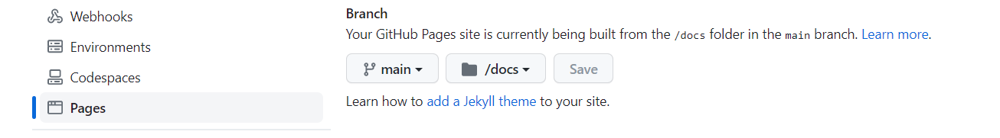

## docsify

> 一个神奇的文档站点生成器。
[docsify官网](https://docsify.js.org/#/)

## 如何使用docsify

### 全局安装 docsify-cli 
可以实现在本地初始化和预览网站。
```
npm i docsify-cli -g
```
 ### 使用 init 命令初始化项目
```bash
docsify init ./docs
```
> After the `init` is complete, you can see the file list in the `./docs` subdirectory.

- `index.html` as the entry file
- `README.md` as the home page
- `.nojekyll>` prevents GitHub Pages from ignoring files that begin with an underscore

### 启动项目

> 在docs的上一级目录，以 docsify serve 运行本地服务器。您可以在浏览器中预览您的网站 http://localhost:3000
```bash
docsify serve docs
```
### 部署到github

```bash
在github上创建一个以账户名开头的仓库（liubo0056.github.io）
git clone 克隆仓库的本地
把前面创建的项目放到本地仓库中
git status
git add .
git commit -m 'tips'
git push
```
<<<<<<< HEAD
:heart: 代码上传后还要设置页面目录


### 文件路由格式

```bash
docs/README.md        => http://domain.com
docs/guide.md         => http://domain.com/#/guide
docs/zh-cn/README.md  => http://domain.com/#/zh-cn/
docs/zh-cn/guide.md   => http://domain.com/#/zh-cn/guide
```
### 侧边栏菜单

```html
<!-- index.html -->
<script>
  window.$docsify = {
    loadSidebar: true
  }
</script>
<script src="//cdn.jsdelivr.net/npm/docsify/lib/docsify.min.js"></script>
```
接着创建 _sidebar.md 文件，内容如下

```markdown
<!-- docs/_sidebar.md -->

* [首页](/)
* [指南](/guide)
```
> tips:目录中创建一个 README.md 文件来作为路由的默认网页。

### 显示目录

自定义侧边栏同时也可以开启目录功能。设置 subMaxLevel 配置项

> 避坑：要在liubo0056.github.io内部再右键git bash here.

6.代码上传后还要设置页面目录才能打开网页liubo0056.github.io


>>>>>>> 07d2a55b1273d269198b23421046f245f4038672

```html
<!-- index.html -->

<script>
  window.$docsify = {
    loadSidebar: true,
    subMaxLevel: 2
  }
</script>
<script src="//cdn.jsdelivr.net/npm/docsify/lib/docsify.min.js"></script>
```

> 忽略副标题

当设置了 subMaxLevel 时，默认情况下每个标题都会自动添加到目录中。如果你想忽略特定的标题，可以给它添加 <!-- {docsify-ignore} --> 。

```markdown
# Getting Started

## Header <!-- {docsify-ignore} -->

该标题不会出现在侧边栏的目录中。
```

要忽略特定页面上的所有标题，你可以在页面的第一个标题上使用 `<!-- {docsify-ignore-all} -->` 。

```
# Getting Started <!-- {docsify-ignore-all} -->

## Header

该标题不会出现在侧边栏的目录中。
```

### 顶部导航

可以通过 Markdown 文件来配置导航。首先配置 `loadNavbar`，默认加载的文件为 `_navbar.md`

```
<!-- index.html -->

<script>
  window.$docsify = {
    loadNavbar: true
  }
</script>
<script src="//cdn.jsdelivr.net/npm/docsify/lib/docsify.min.js"></script>
```

```
<!-- _navbar.md -->

* [首页](/)
* [导航](/guide.md)
```

嵌套:如果导航内容过多，可以写成嵌套的列表，会被渲染成下拉列表的形式。

```markdown
<!-- _navbar.md -->

* 入门

  * [快速开始](zh-cn/quickstart.md)
  * [多页文档](zh-cn/more-pages.md)
  * [定制导航栏](zh-cn/custom-navbar.md)
  * [封面](zh-cn/cover.md)


* 配置
  * [配置项](zh-cn/configuration.md)
  * [主题](zh-cn/themes.md)
  * [使用插件](zh-cn/plugins.md)
  * [Markdown 配置](zh-cn/markdown.md)
  * [代码高亮](zh-cn/language-highlight.md)
```

整合自定义导航栏与 emoji 插件

```html
<!-- index.html -->

<script>
  window.$docsify = {
    // ...
  }
</script>
<script src="//cdn.jsdelivr.net/npm/docsify/lib/docsify.min.js"></script>
<script src="//cdn.jsdelivr.net/npm/docsify/lib/plugins/emoji.min.js"></script>
```

例如，你可以在自定义导航栏 Markdown 文件中使用旗帜表情：

```markdown
<!-- _navbar.md -->
* [:cn:首页](/)
* [:cn:导航](/guide.md)
```

### 封面设置
通过设置 `coverpage` 参数，可以开启渲染封面的功能。封面的生成同样是从 markdown 文件渲染来的。开启渲染封面功能后在文档根目录创建 `_coverpage.md` 文件。

```
<!-- index.html -->

<script>
  window.$docsify = {
    coverpage: true
  }
</script>
<script src="//cdn.jsdelivr.net/npm/docsify/lib/docsify.min.js"></script>
```

```
<!-- _coverpage.md -->


# docsify <small>3.5</small>

> 一个神奇的文档网站生成器。

- 简单、轻便 (压缩后 ~21kB)
- 无需生成 html 文件
- 众多主题

[GitHub](https://github.com/docsifyjs/docsify/)
[Get Started](README#如何使用docsify)
```

>  tips:通常封面和首页是同时出现的，当然你也是当封面独立出来通过设置[onlyCover 选项](https://docsify.js.org/#/zh-cn/configuration?id=onlycover)。
### 全局搜索
```javascript
search: 'auto', // 默认值
<script src="//cdn.jsdelivr.net/npm/docsify/lib/plugins/search.min.js"></script>
```
